# MArKE-IT Workflow ユーザーマニュアル

---

## 目次

1. [システム概要](#1-システム概要)
2. [ログイン・ログアウト](#2-ログインログアウト)
3. [画面構成](#3-画面構成)
4. [案件一覧](#4-案件一覧)
5. [案件詳細・編集](#5-案件詳細編集)
6. [受注一覧](#6-受注一覧)
7. [受注新規作成](#7-受注新規作成)
8. [受注詳細・編集](#8-受注詳細編集)
9. [設定](#9-設定)
10. [管理者向け設定](#10-管理者向け設定)

---

## 1. システム概要

**MArKE-IT Workflow** は、案件・受注情報を Notion データベースで管理し、受注作成時に Google Drive のテンプレートフォルダのコピーや進行タスクの自動生成を行う業務管理 Web アプリです。

| 機能                   | 説明                                                   |
| ---------------------- | ------------------------------------------------------ |
| 案件管理               | 顧客案件の情報登録・進捗管理                           |
| 受注管理               | 受注情報の登録・ステータス管理                         |
| ワークフロー自動生成   | 受注作成時にタスクテンプレから進行タスクを自動生成     |
| Google Drive 連携      | テンプレートフォルダの自動コピー・ドキュメント差し込み |
| ドキュメントリンク連携 | コピーされたファイルのリンクを進行タスクに自動設定     |

> **データの保存先**: すべてのデータは Notion データベースに保存されます。このシステムは Notion への操作インターフェースです。

---

## 2. ログイン・ログアウト

### ログイン

> 📷 **［画像］ログイン画面のスクリーンショット**

1. ブラウザでシステムの URL にアクセスします
2. メールアドレスとパスワードを入力して **「ログイン」** ボタンをクリックします

> **注意**: アカウントは管理者が作成します。自己登録はできません。初回ログイン時は管理者から通知された初期パスワードを使用し、ログイン後すぐにパスワードを変更してください。

### パスワードをお忘れの場合

1. ログイン画面の **「パスワードをお忘れの方」** をクリックします
2. 登録済みのメールアドレスを入力して送信します
3. 受信したメールのリンクからパスワードを再設定します

### ログアウト

1. 画面右上のアバター（名前の頭文字）をクリックします
2. ドロップダウンから **「ログアウト」** を選択します

---

## 3. 画面構成

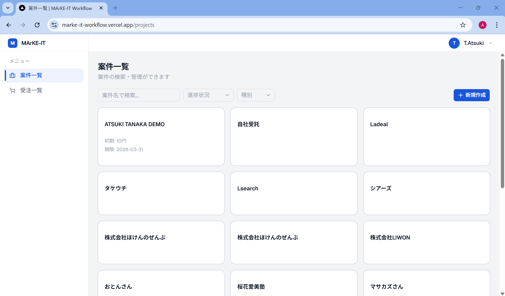

| 領域                   | 説明                                                                             |
| ---------------------- | -------------------------------------------------------------------------------- |
| **サイドバー**（左端） | 案件一覧・受注一覧へのナビゲーション。現在のページは左端に青いバーが表示されます |
| **ヘッダー**（右上）   | ログインユーザーのアバターと名前。クリックで設定・ログアウトメニュー             |
| **メインコンテンツ**   | 各ページのコンテンツ                                                             |

---

## 4. 案件一覧

### 一覧の見方

案件はカード形式で表示されます。各カードには以下が表示されます。

- **案件名**
- **進捗状況バッジ**（見込み／進行中／契約／運用中／納品済み）
- **種別**（個人／企業）
- **初期費用・月額費用**
- **期限**

### 絞り込み・検索

画面上部のフィルターエリアで絞り込みができます。

| フィルター   | 説明                                              |
| ------------ | ------------------------------------------------- |
| **検索**     | 案件名でキーワード検索（入力後 0.3 秒で自動検索） |
| **進捗状況** | ステータスで絞り込み                              |
| **種別**     | 個人 / 企業で絞り込み                             |

フィルターをリセットするには **「リセット」** ボタンをクリックします。

### ページネーション

一覧の下部に **「次へ」「前へ」** ボタンが表示されます。1ページあたり 20 件表示されます。

### 案件の新規作成

1. 画面右上の **「新規作成」** ボタンをクリックします

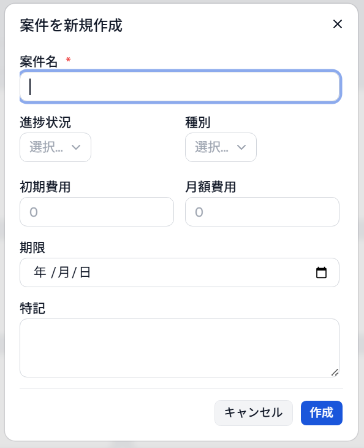

2. 以下の項目を入力します

| 項目     | 必須 | 説明                                   |
| -------- | ---- | -------------------------------------- |
| 案件名   | ✅   | 顧客・プロジェクト名                   |
| 進捗状況 | -    | 見込み／進行中／契約／運用中／納品済み |
| 種別     | -    | 個人 / 企業                            |
| 初期費用 | -    | 数値（円）                             |
| 月額費用 | -    | 数値（円）                             |
| 期限     | -    | 日付                                   |
| 特記     | -    | メモ・備考                             |

3. **「作成」** ボタンをクリックします
4. 一覧の先頭に新しい案件が追加されます

---

## 5. 案件詳細・編集

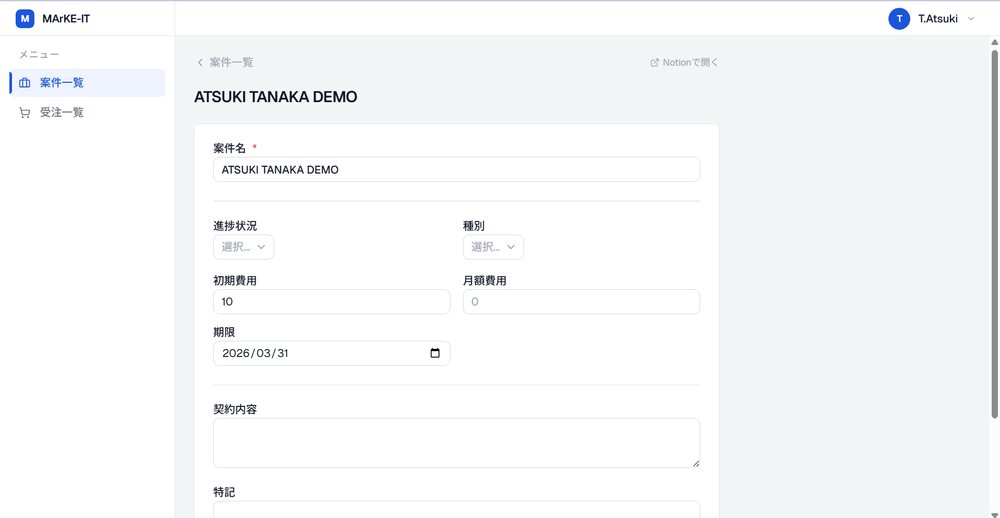

案件カードをクリックすると詳細ページに移動します。

### 編集方法

1. 各フィールドを直接編集します
2. **「保存」** ボタンをクリックして変更を確定します

編集できる項目は新規作成時と同じです。「受注費総計」「案件進捗」は Notion の数式プロパティのため編集できません（自動計算されます）。

---

## 6. 受注一覧

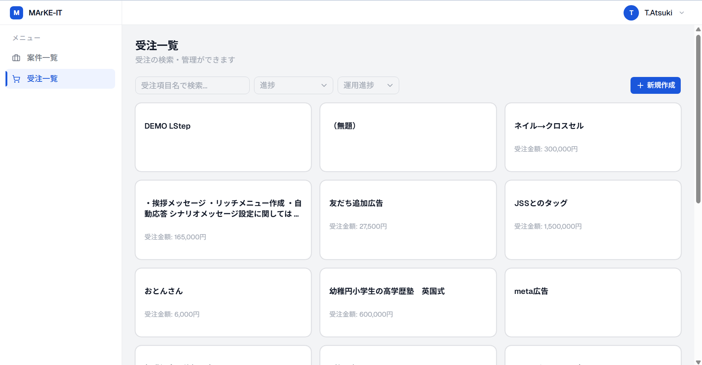

### 一覧の見方

受注はカード形式で表示されます。各カードには以下が表示されます。

- **受注項目名**
- **進捗バッジ**
- **運用進捗**
- **受注金額**

### 絞り込み・検索

| フィルター   | 説明                        |
| ------------ | --------------------------- |
| **検索**     | 受注項目名でキーワード検索  |
| **進捗**     | ステータスで絞り込み        |
| **運用進捗** | 運用中 / 運用終了で絞り込み |

---

## 7. 受注新規作成

受注の新規作成は、ワークフロー（進行タスク）の自動生成や Google Drive のフォルダコピーを同時に行う重要な操作です。

### 手順

1. 受注一覧画面の **「新規作成」** ボタンをクリックします

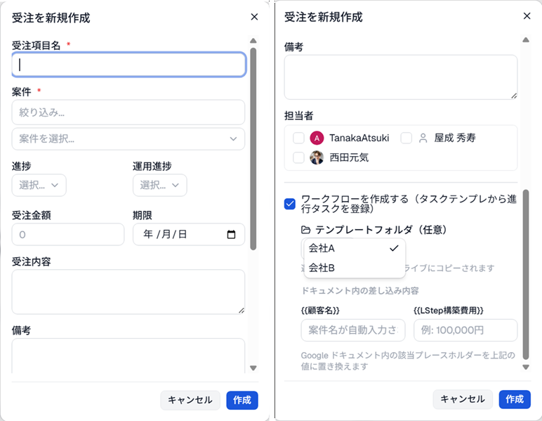

2. 以下の項目を入力します

#### 基本情報

| 項目       | 必須 | 説明                                             |
| ---------- | ---- | ------------------------------------------------ |
| 受注項目名 | ✅   | 受注の名称                                       |
| 案件       | ✅   | ひもづける案件を選択。上部の検索欄で絞り込み可能 |
| 業界       | -    | Notion に登録済みの業界を複数選択可能            |
| 進捗       | -    | 未着手／見込み／商談待ち／商談済み／進行中 etc.  |
| 運用進捗   | -    | 運用中 / 運用終了                                |
| 受注金額   | -    | 数値（円）                                       |
| 期限       | -    | 日付                                             |
| 受注内容   | -    | 詳細説明                                         |
| 備考       | -    | メモ                                             |
| 担当者     | -    | 設定に登録済みの Notion ユーザーから選択         |

#### ワークフロー設定

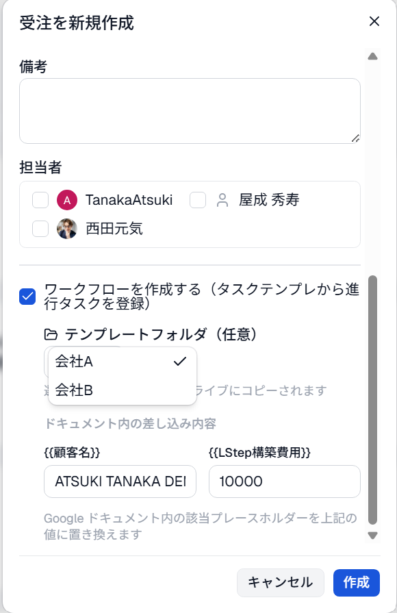

**「ワークフローを作成する」** チェックボックスがオンの場合（デフォルト）、受注作成と同時に以下が自動実行されます。

- タスクテンプレ DB の有効なテンプレートから **進行タスクを自動生成**
- 担当者が設定されている場合、各進行タスクに **担当者を自動設定**

**テンプレートフォルダ（任意）** を選択すると、さらに以下が実行されます。

- 選択したフォルダを Google Drive の作業フォルダに **コピー**
- コピーされたフォルダへのリンクを受注の **「Google ドライブ URL」** に自動設定
- コピーされたファイルのリンクを、ドキュメント名が一致する **進行タスクのドキュメントリンク** に自動設定

#### ドキュメント差し込み

テンプレートフォルダを選択すると、差し込み項目の入力欄が表示されます。

| フィールド          | 説明                                                 |
| ------------------- | ---------------------------------------------------- |
| `{{顧客名}}`        | 案件選択時に案件名が自動入力されます。変更も可能です |
| `{{LStep構築費用}}` | 費用を入力します（例: 100,000円）                    |

入力した内容は、コピーされた Google ドキュメント内の該当プレースホルダーに自動置換されます。

3. **「作成」** ボタンをクリックします

> ⚠️ **作成ボタンを押すと、モーダル上部にプログレスバーが表示されます。** Google Drive のフォルダコピーが含まれる場合は完了まで数秒〜十数秒かかります。「受注を作成しました」のトースト通知が出たら完了です。処理中はモーダルを閉じないでください。

---

### ⚠️ 重要：Notion でテンプレートを選択する必要があります

受注を作成した後、**Notion 側で追加の操作が必要です。**

受注作成時に自動生成された進行タスクは、Notion の **進行タスク DB** に登録されます。ただし、各タスクのサブアイテムや詳細コンテンツは **Notion のタスクテンプレ機能（テンプレートボタン）** を使って適用する必要があります。

#### Notion での操作手順

1. **Notion** を開き、作成した受注一覧 に移動します
2. 新しく作成された受注項目を開きます
3. ページ内の **「進行フローテンプレート」** をクリックします
   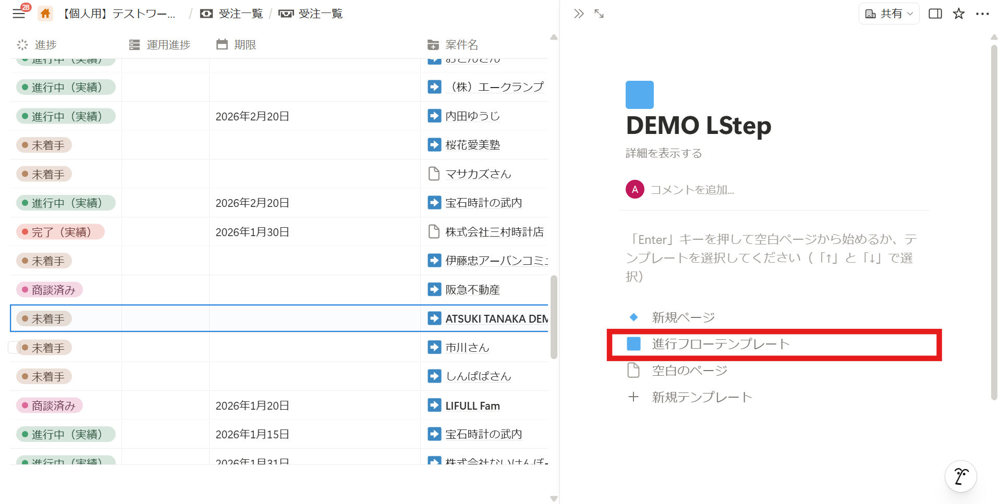

4. テンプレートが適用され、詳細なサブタスクや項目が展開され、進行フローを確認できるようになります。
   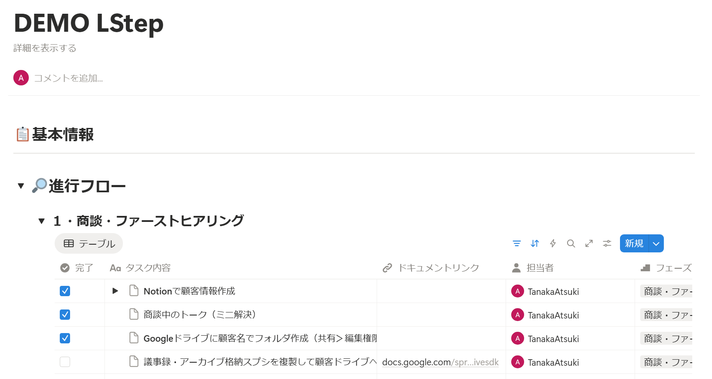
5. 受注一覧では、進行フロー内のチェックボックス（プロパティ名:完了）を集計して、進捗状況を確認することができます。
   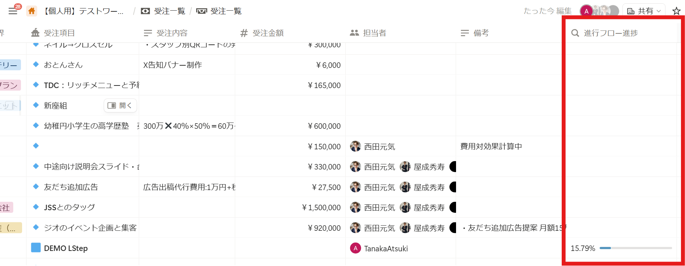

---

## 8. 受注詳細・編集

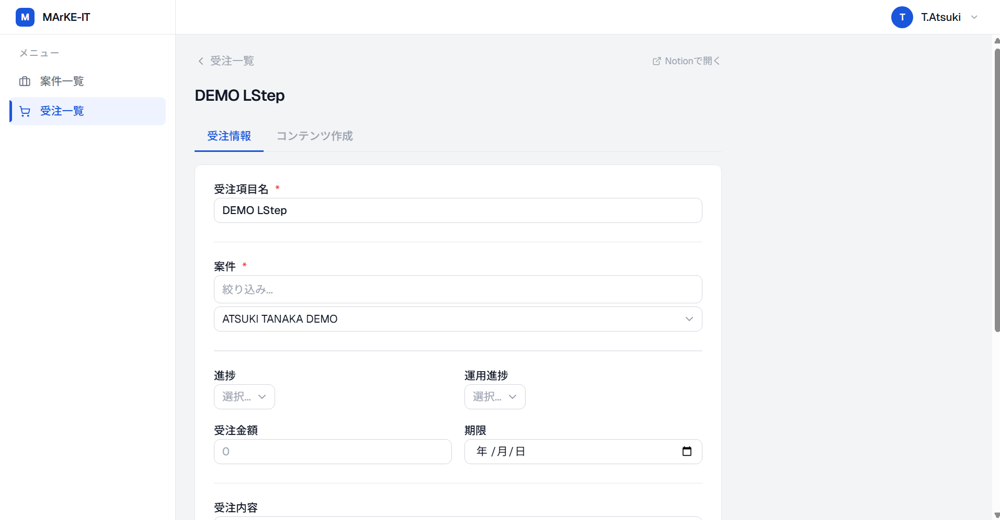

受注カードをクリックすると詳細ページに移動します。ページ上部に 2 つのタブがあります。

### 「受注情報」タブ

受注の基本情報を確認・編集できます。

編集できる項目：

| 項目                | 説明                                           |
| ------------------- | ---------------------------------------------- |
| 受注項目名          |                                                |
| 業界                | Notion に登録済みの業界を複数選択可能          |
| 進捗                |                                                |
| 運用進捗            |                                                |
| 受注金額            |                                                |
| 期限                |                                                |
| 受注内容            |                                                |
| 備考                |                                                |
| Google ドライブ URL | Drive フォルダのリンク（受注作成時に自動設定） |

編集後、**「保存」** ボタンをクリックして確定します。

### 「コンテンツ作成」タブ

現在準備中の機能です。

---

## 9. 設定

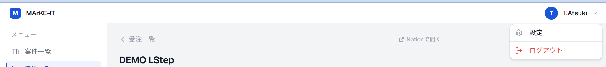
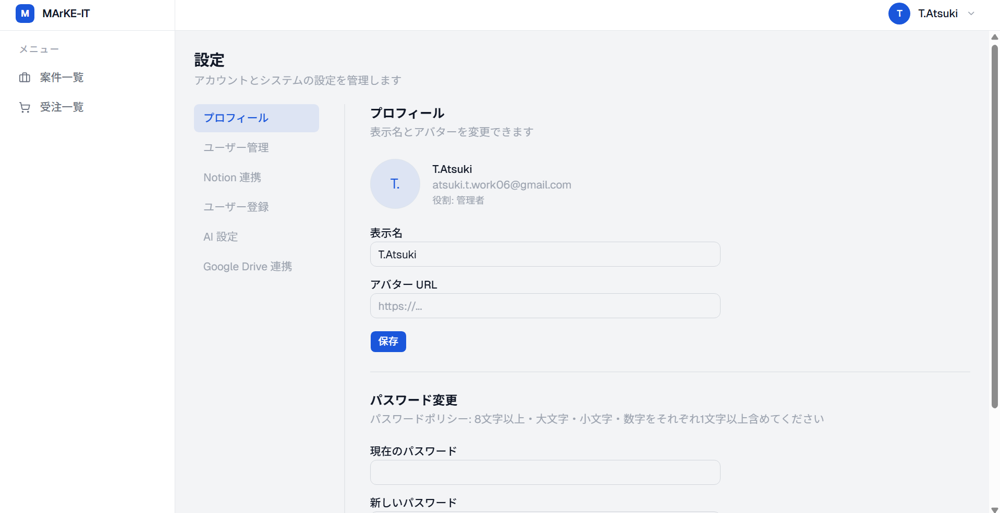

ヘッダー右上のアバターから **「設定」** を選択すると設定画面に移動します。

### プロフィール

自分のアカウント情報を変更できます。

| 項目           | 説明                                             |
| -------------- | ------------------------------------------------ |
| 表示名         | アプリ内で表示される名前                         |
| アバター URL   | プロフィール画像の URL                           |
| パスワード変更 | 現在のパスワードと新しいパスワードを入力して変更 |

**パスワードのルール**: 8文字以上・大文字・小文字・数字をそれぞれ1文字以上含む

---

## 10. 管理者向け設定

以下の設定タブは **管理者（admin）ロール** のユーザーのみ表示されます。

### ユーザー管理

> 📷 **［画像］ユーザー管理タブのスクリーンショット**

#### ユーザー追加

1. **「ユーザーを追加」** ボタンをクリックします
2. メールアドレスと表示名を入力します
3. **「作成」** をクリックすると、初期パスワードが自動生成されて表示されます
4. 表示された初期パスワードをユーザーに通知します（画面を閉じると確認できなくなります）

> ⚠️ **初期パスワードは作成直後のみ表示されます。** ユーザーへの共有を忘れずに行ってください。

#### ロール変更

ユーザー一覧の各ユーザーのロールを **「一般」「管理者」** で切り替えられます。

#### ユーザー削除

1. 削除したいユーザーの行にあるゴミ箱アイコンをクリックします
2. 「削除しますか？」の確認が表示されるので **「はい」** をクリックします
3. ユーザーが削除され、一覧から消えます

> ⚠️ 削除は取り消せません。また、自分自身は削除できません。

### Notion 連携

Notion API トークンを登録します。

1. Notion のインテグレーション設定ページでトークンを取得します
2. トークンを入力して **「保存」** をクリックします

> ⚠️ `ENCRYPTION_KEY` が Vercel に設定されていないとトークンの保存・復号に失敗します。

### ユーザー登録（Notion ユーザー）

受注作成時の **担当者ピッカー** に表示するユーザーを登録します。

1. **「Notion ワークスペースから取得」** ボタンをクリックして、Notion ワークスペースのメンバーを一覧表示します
2. 追加したいユーザーの **「登録」** ボタンをクリックします
3. 登録済みユーザーは一覧に表示されます。不要なユーザーは **「削除」** で除外できます。

### AI 設定

AI 機能で使用する API キーを登録します（現在この機能は準備中です）。

### Google Drive 連携

Google Drive との連携設定を行います。

#### 設定手順

1. **Google Cloud Console** で OAuth クライアント ID とシークレットを取得し、入力して **「保存」** します
2. **「Google アカウントで認可」** ボタンをクリックし、Google アカウントの認可を行います
3. 認可完了後、以下のフォルダ ID を設定します

| 設定項目                | 説明                                                              |
| ----------------------- | ----------------------------------------------------------------- |
| テンプレートフォルダ ID | コピー元となるテンプレートが格納された Google Drive フォルダの ID |
| 作業フォルダ ID         | コピー先となる作業用 Google Drive フォルダの ID                   |

> Google Drive フォルダの ID は、フォルダを開いた URL の末尾の文字列です。  
> 例: `https://drive.google.com/drive/folders/`**`1AbCdEfGhIjKlMnOpQrStUvWxYz`**

---

## よくある質問

**Q. 案件一覧・受注一覧が表示されない**  
A. Notion トークンが設定画面で登録されているか確認してください。また、管理者に `ENCRYPTION_KEY` および `SUPABASE_SERVICE_ROLE_KEY` が Vercel の環境変数に設定されているか確認を依頼してください。

**Q. 受注作成時に Google Drive フォルダが表示されない**  
A. 設定 → Google Drive 連携 で認可が完了しているか、テンプレートフォルダ ID が正しく設定されているか確認してください。

**Q. 受注作成後、進行タスクのドキュメントリンクが設定されない**  
A. タスクテンプレ DB の **「ドキュメント名」** プロパティに設定されているテキストが、コピーされたファイル名（`{案件名}_{元のファイル名}` の形式）に含まれているか確認してください。

**Q. パスワードを忘れた**  
A. ログイン画面の **「パスワードをお忘れの方」** からリセットできます。

**Q. アカウントが作れない / ログインできない**  
A. アカウントは管理者が作成します。管理者に連絡してください。
